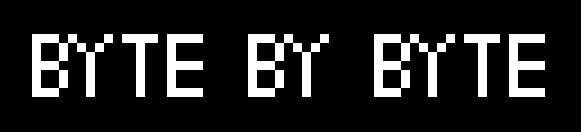

    

Agentic Development Loop · LLM Orchestration · Composition-first OOP · ELF Binary Analysis · Systems Programming · Backend  
Building explainable anomaly detection for ELF binaries using a controlled, agent-driven development loop.  
[ForgeBYTES](https://github.com/ForgeBYTES) · [forgebytes.io](https://forgebytes.io)
